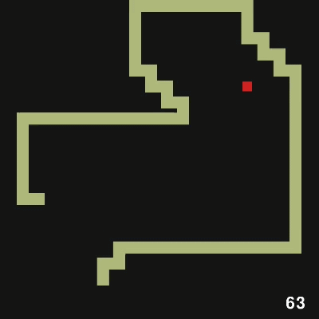
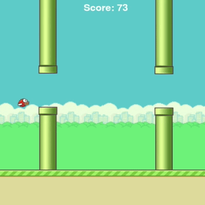
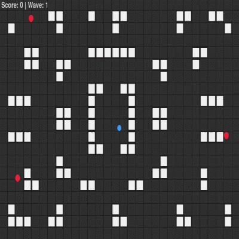
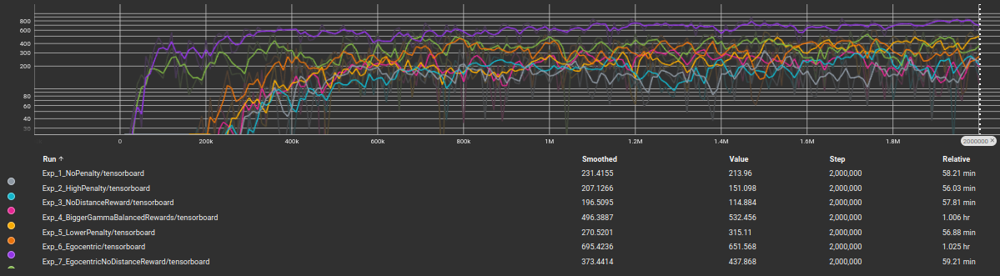
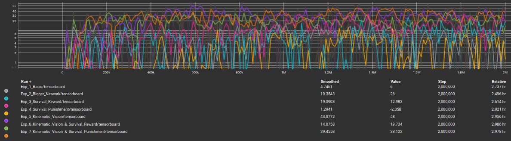

# Development of 2D Games and Design of Reinforcement Learning Agents for Autonomous Solving

<div align="center">


</div>

> **Upcoming Update:** The full official thesis document detailing the mathematical formulations, in-depth architectural choices, and comprehensive analysis will be uploaded to this repository soon.

> An experimental thesis analyzing how Proximal Policy Optimization (PPO) learns to master 2D games of varying complexity. Through a comprehensive pipeline of 21 experiments across three environments, the project explores baseline AI behaviors and tests how modifying Neural Network Architecture, Reward Functions, and Observation Spaces ultimately dictates the agent's abilities to play the game.
---

## Gameplay Highlights

| Snake | Flappy Bird | Shooter |
| :---: | :---: | :---: |
|  |  |  |
| *This result was accomplished by Egocentric Vision in concert with Distance Reward.* | *This result was accomplished by Kinematic Vision in tandem with Positive Reward.* | *This result was accomplished by Dynamic Vision in unison with Negative Reward.* |

---

## Project Overview

The primary objective of this thesis is to evaluate how a Deep Reinforcement Learning algorithm—specifically Proximal Policy Optimization (PPO)—adapts to and masters completely distinct environmental mechanics. Rather than focusing on a single task, the agent is deployed across three fundamentally different 2D games to observe its baseline reactions to unique challenges:

*   **Snake:** The agent must learn to navigate toward dynamically spawning food while managing spatial awareness to avoid a continuously growing body.
*   **Flappy Bird:** The agent must understand the concept of constant gravity, timing precise discrete actions (jumps) to pass through narrow, shifting gaps.
*   **Top-Down Shooter:** The agent faces a highly dynamic environment with complex, high-dimensional inputs, requiring it to outmaneuver enemy AI and dodge incoming projectiles.

After establishing baseline behaviors for each game, the project systematically attempts to improve the AI's performance through a rigorous **7-experiment pipeline**. By tweaking neural network architectures, reshaping reward functions (e.g., time penalties vs. survival rewards), and upgrading observation spaces (e.g., integrating kinematic velocity vectors), the thesis demonstrates exactly what it takes to push an RL agent from basic competence to optimal tactical behavior in any given environment.

### Experimental Methodology & The 7-Step Pipeline

While each environment features unique mechanics (e.g., gravity, growing hitboxes, projectile tracking), the training process across all three games strictly adheres to a 7-experiment thematic progression. This structured pipeline isolates the specific impact of network scaling, reward shaping, and observation space design.

| Exp | Experimental Focus | Observation Space | Reward Shaping | Primary Objective & General Observation |
| :--- | :--- | :--- | :--- | :--- |
| **1** | **Baseline Evaluation** | Static (Absolute Coordinates) | Standard Task Reward | Establishes baseline PPO performance. Agents typically struggle with dynamic tactical decisions. |
| **2** | **Hyperparameter & Network Scaling** | Static | Standard Task Reward | Evaluates whether increasing neural network capacity (e.g., [256, 256]) or tuning exploration (entropy) can overcome poor state representation. |
| **3** | **Positive Reward Shaping** | Static | + Survival / Distance | Introduces positive reinforcements. Often leads to reward hacking, where the agent maximizes the secondary reward while ignoring the main objective. |
| **4** | **Negative Reward Shaping** | Static | - Time / Step Penalties | Introduces urgency. Without advanced vision, the pressure frequently results in aggressive but suboptimal or suicidal behavior. |
| **5** | **Advanced Observation Integration** | Kinematic / Egocentric | Standard Task Reward | Upgrades inputs (e.g., velocity vectors, relative rays). Results in a drastic performance spike, unlocking predictive maneuvering. |
| **6** | **Advanced Vision & Positive Shaping** | Kinematic / Egocentric | + Survival / Distance | Combines enhanced state representation with positive guidance, often yielding peak scores and highly cautious, prolonged gameplay. |
| **7** | **Advanced Vision & Sparse Penalties** | Kinematic / Egocentric | - Sparse / Time Penalties | Forces optimal, aggressive execution. The agent relies solely on its superior vision and the pressure of penalties to master the environment without artificial positive guidance. |
---

## Training Results & Learning Curves

The graphs below illustrate the impact of modifying the agent's observation space and reward structure. Displaying the **Evaluation Mean Reward** across the 7 experiments of each game, it is evident that providing the agent with kinematic/egocentric vision combined with appropriate penalties drastically accelerates convergence and maximizes true policy performance compared to the baseline static models.

> *Note: Some experiment names within the graphs may differ slightly from the final terminology used in this repository.*

<div align="center">

### Snake
---


### Flappy Bird
---


### Shooter
---


</div>


> **Reproducibility Disclaimer:** Due to the inherent stochastic nature of Reinforcement Learning algorithms (e.g., random network weight initialization, environment seeds, and action sampling), retraining the models from scratch may yield slightly different learning curves and final performance metrics than the ones presented above.

---

## Repository Structure

```text
Thesis_PPO_2D_Games/
├── README.md
├── requirements.txt
├── assets/
│   ├── GIFs/                     # Gameplay animations
│   ├── Full Videos/              # Complete evaluation runs
│   └── Graphs/                   # TensorBoard learning curves
│       ├── Flappy Bird/                     
│       ├── Shooter/            
│       └── Snake/                        
├── Models/                       # Pre-trained models and TensorBoard logs
│   ├── Flappy Bird/
│   │   ├── Exp_1_Basic/
│   │   │   ├── saved_models/     # Contains .zip checkpoints and .npz evaluations
│   │   │   └── tensorboard/      # Contains training logs and tf events
│   │   ├── Exp_2_Entropy_coef/
│   │   └── ...                   # Exp 3 through 7
│   ├── Shooter Game/
│   │   ├── Exp_1_Basic/
│   │   ├── Exp_2_Bigger_Network/
│   │   └── ...                   # Exp 3 through 7
│   └── Snake/
│       ├── Exp_1_Distance_Reward/
│       ├── Exp_2_Distance_Reward_and_HighPenalnty/
│       └── ...                   # Exp 3 through 7
├── Snake/
│   ├── Snake_base_game.py        # The actual game that anyone can run and play
│   ├── train_exp1_distance_reward.py
│   ├── ...
│   └── play_snake_experiments.py # Interactive control room to test models
├── Flappy_Bird/
│   ├── Flappy Bird_base_game.py  # The actual game that anyone can run and play
│   ├── train_exp1_basic.py
│   ├── ...
│   └── play_flappy_experiments.py
└── Shooter/
    ├── Shooter_game_base_game.py # The actual game that anyone can run and play
    ├── train_exp1_basic.py
    ├── ...
    └── play_shooter_game_experiments.py
```
---

## Installation & Setup

To run the environments and evaluate the trained models locally, follow these steps:

1. **Clone the repository:**
   ```bash
   git clone https://github.com/NakosV/Thesis-PPO-2D-Games.git
   cd Thesis-PPO-2D-Games
   ```

2. **Install dependencies:**
   It is recommended to use a virtual environment (e.g., `venv` or `conda`). Then, install the required packages:
   ```bash
   pip install -r requirements.txt
   ```

---

## How to Evaluate Models

You don't need to retrain the agents to see them in action. Each game folder contains an evaluation script that loads the pre-trained checkpoints. 

To watch the **Shooter Game** agent play:
```bash
cd Shooter
python play_shooter_game_experiments.py
```
*A menu will prompt you to select the experiment (1-7) you wish to observe folloed by another menu that will prompt you to select the version of the model that you want to test (1-6).*

## Credits & References

The custom 2D environments developed for this thesis were built using **Pygame**, drawing mechanical inspiration and utilizing assets from the open-source community:

* **Flappy Bird:** Base game mechanics and rendering logic adapted from the tutorial by [Coding With Russ](https://www.youtube.com/watch?v=GiUGVOqqCKg), using environmental assets provided in his [pygame_flappy_bird_assets](https://github.com/russs123/pygame_flappy_bird_assets) repository.
* **Snake:** Grid mechanics and surface rendering inspired by the tutorial from [Clear Code](https://www.youtube.com/watch?v=QFvqStqPCRU).
* **Top-Down Shooter:** Completely custom-built environmental mechanics, colliders, and enemy AI, synthesized from various Pygame development sources and personal engineering.
